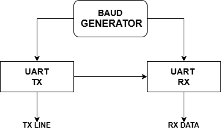
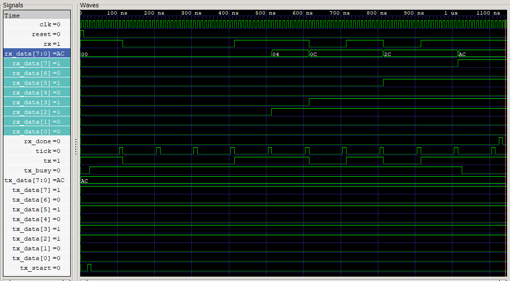

# UART Communication Controller

A Verilog UART project with:

- a baud rate generator
- a UART transmitter
- a UART receiver
- a loopback testbench

In the current testbench, the transmitter output is connected directly to the receiver input, so the design can be tested completely in simulation.

### UART Block Diagram



### Simulation Waveform



## Running the Simulation

This project works with Icarus Verilog.

### Compile

```powershell
iverilog -o uart_check.out uart_tb.v uart_tx.v uart_rx.v baud_gen.v
```

### Run

```powershell
vvp uart_check.out
```

## Viewing the Waveform

The testbench generates a waveform file named `wave.vcd`.

You can open it with GTKWave:

```powershell
gtkwave wave.vcd
```

## Future Improvements

- Add support for multiple test cases
- Test different bytes automatically
- Add parity support
- Add configurable baud divisor calculation
- Improve the receiver sampling strategy for a more realistic UART design

## Author

UART Communication Controller project in Verilog for learning and simulation practice.
